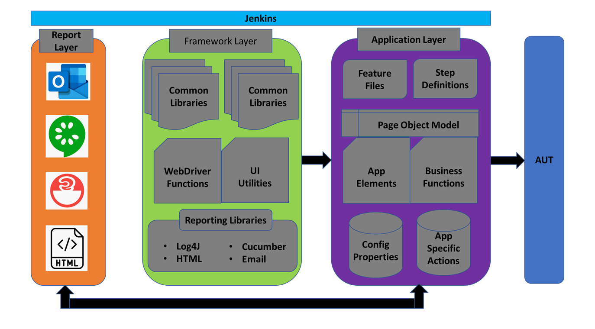
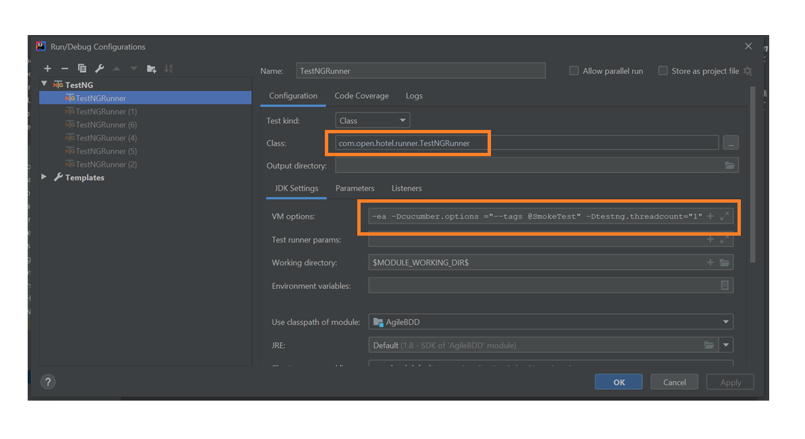
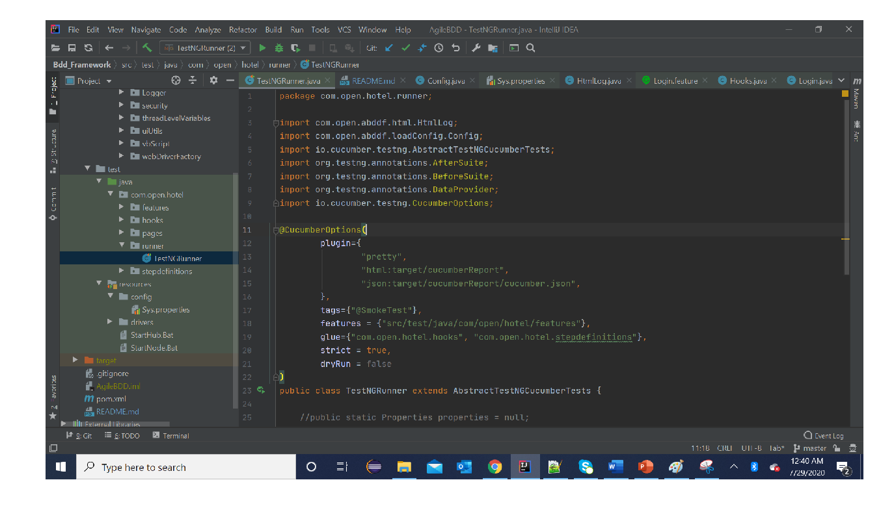

#BDD Agile Automation Framework

BDD Agile automation framework (BDDAAF) is an open source hybrid Selenium, Cucumber, Java, Maven, TestNG based test automation framework. The framework is based on Page Factory module principals, enables teams to fully utilize the robust libraries. 

Framework works based off on layers to eliminate redundancy and bulkiness, and each layer is segregated and isolated to maintain the transparency.

BDDAAF is built using a very thin, less complicated, robust, flexible, and extensible architecture that supports parallel development of automation suites and parallel test case execution using Selenium Grid. The framework contains classes and methods that are built to encourage their reuse across test automation suite. Integrating with Git and Jenkins, the BDDAAF will support continuous integration (CI) and Continuous deployment (CD).

##Architecture

###Test Runner
we can use JUnit or TestNG Runners, recommended to use TestNGRunner because parallel execution is possible in scenarios level.

###Run Test Modes
 You can run scripts in 3 ways
 1. CLI Mode: mvn
 2. IDE Cucumb er Plugin
    * IntelliJ IDE Minimum version 2020.1 is required
 3. Using Runner
 
 
 ### CLI Mode : Using Maven
 Open Terminal or Command prompt and navigate to the project directory.
 
    mvn test -Dcucumber.options="--tags '@SmokeTest or @all'" -Dtestng.threadcount="2"

 ### CLI Mode : Using IDE

 ### CLI Mode : Using TestNGRunner
